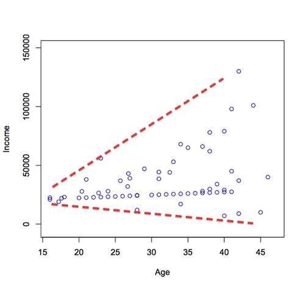

  
```{r setup, include=FALSE}
knitr::opts_chunk$set(echo = TRUE, eval=TRUE, message=FALSE, warning=FALSE, error=FALSE, fig.height = 3, dpi = 300)
library(pander)
library(dplyr)
```

## Contents
1. Different types of data
2. What are correlations? 
3. Exploring correlations with plots
4. Pearson product-moment coefficient *r*
5. Spearman's *rho* and Kendall's *tau*
6. Reporting on correlations
7. Exercises
8. References

## 1. Different types of data
## 1. Different types of data
- Data can be of different types:
    - Nominal or categorical (e.g., `yes` vs. `no`)
- Quantitative:
    - Ordinal-scaled
    - Interval-scaled
    - Ratio-scaled

## 1. Different types of data
- Ordinal-scaled data: 
    - The truly meaningful information is contained not in the values itself, but in their ordering. E.g., *likert-scales*
    - 1 and 5 have no meaning in relation to each other other than e.g., the relative degree of 'agree' vs 'disagree' they represent.

## 1. Different types of data
- Interval-scaled data:
    - e.g., degrees celsius
    - We know the ordering of the values
    - Each value is meaningful on the scale on its own. I.e., each value represents a temperature
    - There is no true zero: 
        - `0` does not represent absence of temperature
        - It is a measurement like any other on the scale

## 1. Different types of data
- Ratio-scaled data:
    - E.g., counts of bacteria on a surface
    - We know the ordering of the values
    - Each value is meaningful on the scale on its own
    - There is a true zero: 0 represents absence of bacteria on the surface

## 2. What are correlations?   
## 2. What are correlations?   (1/4)
- Relationship between two interval-scaled or ratio-scaled variables, which consist in that they increase or decrease in parallel:
    - If X increases with one unit, there will be a constant increase/decrease of N units in Y
    - If X decreases with one unit, there will be a constant increase/decrease of N units in Y
- Data must be paired: for each value in X there must be a corresponding value in Y

## 2. What are correlations? (2/4)
- If X increases and Y increases as well, this is called a `positive` correlation
    - E.g., Age correlates positively with vocabulary size in young children: the older they get, the more words they know. 
- If X increases and Y decreases, this is called a  `negative` correlation
    - E.g., Zipf (1935:25) found that word frequency is negatively correlated to word length: the more frequent a word is, the shorter it tends to be

## 2. What are correlations? (3/4)
- When we analyze relationships between quantitative variables, we are interested in three aspects:
    1. The direction of the correlation: positive or negative correlation?
    2. The size of the correlation: how strong is the relationship between the two variables?
    3. Whether or not the relationship is statistically significant
- The first two can be established with a `correlation coefficient`, the last one requires a `hypothesis test` based on the correlation coefficient

## 2. What are correlations? (4/4)
- Observe that correlations are different from paired t-tests and Wilcoxon tests:
    - t-test compares the means of the pairs
    - Wilcoxon test compares the medians of the pairs
    - <--> Correlations explore the strengths of the associations between the values of the pairs, they offer no information on their means, medians, or the statistical significance of the relationships

## 3. Exploring correlations with plots
## 3. Exploring correlations with plots (1/3)
- We will be working again with the dataset by Balota et al. (2007)
- Research question: 
    - *What is the relationship between the `Length` of a word and the `Mean_RT` in a lexical decision task?*
- Hypothesis:
    - *Shorter words will be recognized faster than longer words*
- Null hypothesis:
    - *There is no difference between short and long words*

```{r data}
library(readr)
library(dplyr)
dataSet <- read_csv("http://www.jeroenclaes.be/statistics_for_linguistics/datasets/class2_balota_et_al_2007.csv")
glimpse(dataSet)
```

## 3. Exploring correlations with plots (2/3)
- Before you do anything else, it is usually a good idea to plot the two variables and their relation in a scatterplot:
    - `geom_point` plots dots for each pair of X, Y values
    - `geom_smooth` fits a line through these dots to inspect the relationship between the variables:
        - Positive correlation: highest tip of the line is on the right-hand side
        - Negative correlation: lowest tip of the line is on the right-hand side
    - `geom_smooth` also adds a 95% conficence interval around the line, in which the true population relationship between the variables will be situated
    - `method="lm"` tells `ggplot` to fit a linear relationship between them (linear regression)

```{r scatterplot1, echo=TRUE, eval=FALSE}
library(ggplot2)
ggplot(dataSet, aes(x=Length, y=Mean_RT)) + 
  geom_point() + 
  geom_smooth(method="lm")
```

## 3. Exploring correlations with plots (3/3)

```{r scatterplot2, echo=TRUE, eval=TRUE}
library(ggplot2)
ggplot(dataSet, aes(x=Length, y=Mean_RT)) + 
  geom_point() + 
  geom_smooth(method="lm")
```

## 4. Pearson's product-moment *r* 

## 4. Pearson's product-moment *r* 
- Just by inspecting the plot we can already see that there is a linear relationship between the length of the word and the time subjects take to recognize it
- To calculate how strongly the two are associated, we can calculate the `Pearson product-moment` correlation coefficient

## 4.1 Assumptions of the Pearson product-moment correlation (1/4)
- The relationship between the two variables is **monotonic**:
    - Each increase in X has a parallel increase in y; each decrease in X is followed by a parallel decrease in Y or vice versa
- The relationship between the two variables is **linear**:
    - Each increase of one unit in X will trigger a constant increase of N units in Y 
- There are no outliers in the data (Levshina, 2015: 122)

## 4.1 Assumptions of the Pearson product-moment correlation (2/4)
- If the data fails to meet these assumptions, the correlation coefficient will not be robust 
- Non-linear relationships:
    - Try a transformation to transform X or Y to a linear relationship (e.g. square, logarithm)
    
```{r scatterplot3, echo=TRUE, eval=TRUE}
library(ggplot2)
ggplot(dataSet, aes(x=Freq, y=Mean_RT)) + 
  geom_point() + 
  geom_smooth(method="lm")
```  
    
## 4.1 Assumptions of the Pearson product-moment correlation (3/4)
- If the data fails to meet these assumptions, the correlation coefficient will not be very robust
- Non-linear relationships:
    - Try a transformation to transform X x Y to a linear relationship (e.g. square, logarithm)
```{r scatterplot4, echo=TRUE, eval=TRUE}
ggplot(dataSet, aes(x=log(1+Freq), y=Mean_RT)) + 
  geom_point() + 
  geom_smooth(method="lm")
```  

## 4.1 Assumptions of the Pearson product-moment correlation (4/4)
- Non-linear relationships:
    - Use Spearman's *rho* or Kendall's *tau* (see below)
- Outliers:
    - Remove outliers
- Non-monotonic:
    - Correlation = 0, pointless
    
## 4.2 Pearson's product-moment *r* (1/3)
- Logic of the test:
    - The values of the two variables are scaled to Z-scores
    - Each scaled value of `Mean_RT` is multiplied with the corresponding value in `Length`
    - The multiplied values are summed together and divided by the sample size
```{r correlation_formula, echo=TRUE, eval=TRUE}
sum(scale(dataSet$Length)*scale(dataSet$Mean_RT))/
  nrow(dataSet)
```

## 4.2 Pearson's product-moment *r* (2/3)
- In R, you can use the `cor` command to calculate the Pearson product-moment *r* correlation coefficient
```{r correlation, echo=TRUE, eval=TRUE}
cor(dataSet$Length, dataSet$Mean_RT)
```

## 4.2 Pearson's product-moment *r* (3/3)
- The correlation coefficient is `r cor(dataSet$Mean_RT, dataSet$Length)`
- This tells us that:
    - There is a positive correlation: if `Length` increases, `Mean_RT` increases too (if the correlation is negative, then the coefficient is negative)
    - The relationship is **moderately strong**
        - 0: No correlation 
        - +/- 0-0.3: Weak correlations
        - +/- 0.3-0.7: Moderate correlation
        - +/- 0.7-1: Strong correlation
        - +/- 1: Perfect correlation

## 4.3 Dangers of ignoring the assumptions
- If we remove outliers, the correlation coeffecient will change, because outliers pull the line on the plots up or down
```{r correlationOutliers, echo=TRUE, eval=TRUE}
dataSet <- dataSet[abs(scale(dataSet$Mean_RT))<2,]
cor(dataSet$Length, dataSet$Mean_RT)
```

- If we fail to recognize a non-linear relationship, the correlation coefficient may be substantially diferent. Compare:

```{r correlationRelations, echo=TRUE, eval=TRUE}
# Frequency vs Mean_RT, without Log transformation of Frequency
cor(dataSet$Freq, dataSet$Mean_RT)

# Frequency vs Mean_RT, with Log transformation of Frequency
 cor(log(1+dataSet$Freq), dataSet$Mean_RT) 
```

## 4.4 Testing the significance of correlations
- If we want to test if a correlation is significant, a few additional assumptions should be met (Levshina, 2015: 126), besides the assumptions of the correlation coefficient. 
- These assumptions are shared by more advanced techniques such as linear regression:
    - The sample is randomly selected from the population it represents. 
    - Both variables are interval- or ratio-scaled. **Ordinal variables won't work!**
    - The sample size is greater than 30 and/or the Y-values that correspond to each value in X are normally distributed and vice versa (`bivariate normal distribution`)
    - The relationship between the variables is `homoskedastic`: the strength of the relationship between the variables is equal across the board
    - The values of X and Y are completely `independent`: there is no `autocorrelation` (correlation between values of X, correlation between the values of Y). E.g., Temperature decreases/increases gradually over the course of a year. The temperature on Feb 26 is correlated to the temperature of Feb 25 and Feb 27, because random jumps in temperature do not occur

## 4.4.1 Validating the assumptions
- The sample size is greater than 30 and/or the Y-values that correspond to each value in X are normally distributed and vice versa (`bivariate normal distribution`):
    - `mvnorm.etest` from the `energy` package
    - First argument: 
        - data.frame with our two variables
    - Second argument: 
        - number of tests the function performs before returning a result (1000 is good practice)
    - Null hypothesis:
        - Data has a bivariate normal distribution (if p < 0.05, it does NOT have a bivariate normal distribution)
```{r correlationAssumptions, echo=TRUE, eval=TRUE}
library(energy)

mvnorm.etest(dataSet[,c("Length", "Mean_RT")], 1000 )
```

## 4.4.1 Validating the assumptions
- The relationship between the variables is `homoskedastic`: the strength of the relationship between the variables is equal across the board:
    - Heteroskedasticity will show up as a *funnel-like pattern* on a scatter plot


## 4.4.1 Validating the assumptions
- Heteroskedasticity is not an issue here at first glance:
```{r scatterPlotHetero, echo=TRUE, eval=TRUE}
library(energy)
ggplot(dataSet, aes(x=Length, y=Mean_RT)) + 
  geom_point() + 
  geom_smooth(method="lm")
```

## 4.4.1 Validating the assumptions
- Heteroskedasticity is a serious problem for correlation analysis and its big brother, linear regression
- In the package `car` ("Companion to Applied Regression"") there is a function that tests for heteroskedasticity based on a linear regression model:
    - `ncvTest` (for non-constant variance test)
    - To be able to use it, we must define a linear regression model. 
    - The null hypothesis is that the data are homoskedastic (NOT heteroskedastic). If p > 0.05, heteroskedasticity is not an issue
    
```{r scatterPlot5, echo=TRUE, eval=TRUE}
mod <- lm(Mean_RT~Length, data=dataSet)
library(car)
ncvTest(mod)
```
 
## 4.4.1 Validating the assumptions
- The values of X and Y are completely `independent`: there is no `autocorrelation`:
    - As heteroskedasticity, autocorrelation is also a serious issue for linear regression
    - The package `car` includes an implementation of the `Durbin-Watson` test
    - The null hypothesis is that there is no autocorrelation. If p < 0.05 your data violates the assumption of no autocorrelation
```{r scatterPlotHetero2, echo=TRUE, eval=TRUE}
mod <- lm(Mean_RT~Length, data=dataSet)
library(car)
durbinWatsonTest(mod)
```

## 4.4.2 Performing the correlation test
- Our data has passed all of the tests. The assumptions are all satisfied. 
- We can now calculate our correlation coefficient and check to see if it is significant:
  - `cor.test` accepts the following arguments:
      - Our two variables
      - `alternative`: 
          - 'less' if the correlation is expected to be negative
          - 'greater' if the correlation is expected to be positive
          - 'two.sided' if the hypothesis is that there is a correlation (default)
          
```{r corTest1, echo=TRUE, eval=TRUE}
cor.test(dataSet$Length, dataSet$Mean_RT, alternative="greater")
```

```{r corTestHidden, echo=F, eval=TRUE}
a<-cor.test(dataSet$Length, dataSet$Mean_RT, alternative="greater")

```

## 4.4.2 Interpreting the output of the correlation test
- The output of `cor.test` tells us the following:
    - p < 0.05: 
        - The null hypothesis of no correlation can be rejected
    - *r* = `r round(a$estimate,2)`: 
        - The correlation is moderately strong
    - 95% confidence interval for R: `r  round(a$conf.int[1],2)` - `r  round(a$conf.int[2],2) `
        - The correlation will be moderately strong to very strong at the population level
```{r corTest2, echo=TRUE, eval=TRUE}
cor.test(dataSet$Length, dataSet$Mean_RT, alternative="greater")
```

## 4.4.2 Calculating the variance explained (R2)
- Once we have established the size and the significance of the correlation between `Length` and  `Mean_RT`, we can use the correlation coefficient to estimate the amount of `Mean_RT` variance that is explained by `Length` by simply squaring the correlation coefficient (R2 or R-squared) (Urdan, 2010:87-88)
    - `variation explained = *r*^2`
    - `Length` explains `r round(a$estimate^2, 4)*100` percent of the variance of `Mean_RT`
    - Answers the question: how well does `Length` explain/model/predict `Mean_RT`?
```{r corTest3, echo=TRUE, eval=TRUE}
a<-cor.test(dataSet$Length, dataSet$Mean_RT, alternative="greater")
a$estimate^2
```   

## 4.4.2 A note of warning
- *Correlation does **not** imply causation*:
    - Be careful to interpret correlations in terms of cause-effect. If something is statistically correlated, it does not necessarily have to be causally related (e.g., http://www.tylervigen.com/spurious-correlations)
    - Statistics may uncover a link between two variables, posterior analysis/theoretical reflection has to make sense of it

## 5. Spearman's *rho* and Kendall's *thau*
## 5. Spearman's *rho* and Kendall's *thau*
- Spearman's *rho* and Kendall's *thau* should be used when your data does not satisfy the assumptions of Pearson's product moment *r*
- These tests can be used for **ordinal**, ratio, and interval data
- The only assumption is that the relationship is monotonic

## 5.1 Data
- Data from Bates & Goodman (1997):
    - Correlation between grammatical complexity and vocabulary size for 10 children between 16 to 30 months old
- Research question: 
    - *Is there a relationship between the size of language learner's lexicon and the complexity of their grammar?*
- Hypothesis:
    - *Grammar develops on a par with vocabulary size*
- Null hypothesis:
    - *There is no correlation between grammar and vocabulary size*
    
```{r dataCoca, echo=TRUE, eval=TRUE}
dataSet <-read_csv("http://www.jeroenclaes.be/statistics_for_linguistics/datasets/class5_Bates_and_Goodman_1997.csv")
glimpse(dataSet)
```

## 5.1 Exploring the correlations between `lexicon_size` and `complexity_score` (1/3)
- The data here are clearly monotonic: for each increase in `lexicon_size` there is a parallel increase in `complexity_score`
- The relationship is not linear, but it is positive and monotonic

```{r plot, echo=TRUE, eval=TRUE}
ggplot(dataSet, aes(x=lexicon_size, y=complexity_score)) + 
  geom_point() + 
  geom_smooth(method="loess") 
```

## 5.1 Exploring the correlations between `lexicon_size` and `complexity_score` (2/3)
- The relationship may not be linear, but we could apply a log-transformation to make it linear
- This is what we would do if we were to perform a regression
- If we transform it, we can use Pearson's *r* if it satisfies the other assumptions
```{r plotLog, echo=TRUE, eval=TRUE}
ggplot(dataSet, aes(x=lexicon_size, y=log(1+complexity_score))) + 
  geom_point() + 
  geom_smooth(method="lm") 
```

## 5.1 Exploring the correlations between `lexicon_size` and `complexity_score` (3/3)
- For non-linear monotonic relationships, we cannot use the parametric (and conceptually relatively simple) Pearson's *r*
- The non-parametric methods Spearman's *rho* and Kendall's *tau* are better-suited as these make no assumptions about the relationships or the shape of the data
- These tests can also be used for `ordinal data` (e.g., Likert scales)
- To use Spearman's *rho* or Kendall's *tau*, we simply add `method="spearman"` or `method="kendall"` to `cor` or `cor.test`
- Kendall's `tau` will generally yield less extreme correlation estimates than Spearman's `rho`
```{r corDat, echo=TRUE, eval=TRUE}
cor.test(dataSet$lexicon_size, dataSet$complexity_score, method="spearman", alternative="greater")
```

## 5.1 Exploring the correlations between `lexicon_size` and `complexity_score` (3/3)
- For non-linear monotonic relationships, we cannot use the parametric (and conceptually relatively simple) Pearson's *r*
- The non-parametric methods Spearman's *rho* and Kendall's *tau* are better-suited as these make no assumptions about the relationships or the shape of the data
- These tests can also be used for `ordinal data` (e.g., Likert scales)
- To use Spearman's *rho* or Kendall's *tau*, we simply add `method="spearman"` or `method="kendall"` to `cor` or `cor.test`
- Kendall's `tau` will generally yield less extreme correlation estimates than Spearman's `rho`
```{r corDat2, echo=TRUE, eval=TRUE}
cor.test(dataSet$lexicon_size, dataSet$complexity_score, method="kendall", alternative="greater")
```

## 6. Reporting on correlations
- Correlation coefficient (r, rho or tau)
- Degrees of freedom (for Pearson's *r*)
- p-value and test statistic (t for Pearson, S for Spearman, T for Kendall)
- type of test (one-tailed, two-tailed)

## 7. Exercises
- Please go to http://www.jeroenclaes.be/statistics_for_linguistics/class5.html and perfom the exercises.

## 8. Questions?
??

## 9. References
- Balota, D.A., Yap, M.J., & Cortese, M.J., et al. (2007). The English Lexicon Project. *Behavior Research Methods*, 39(3), 445–459. DOI: 10.3758/BF03193014. Data taken from Levshina (2015).
- Bates, E., & Goodman, J. (1997).  On the inseparability of grammar and the lexicon: Evidence from acquisition, aphasia and real-time processing. *Language and Cognitive Processes* 12(5/6). 507-586.
- Levshina, N. (2015). *How to do Linguistics with R: Data exploration and statistical analysis*. Amsterdam/Philadelphia, PA: John Benjamins.
- Zipf, G.K. (1935).*The psycho-biology of language*. Boston: Houghton Mifflin.


